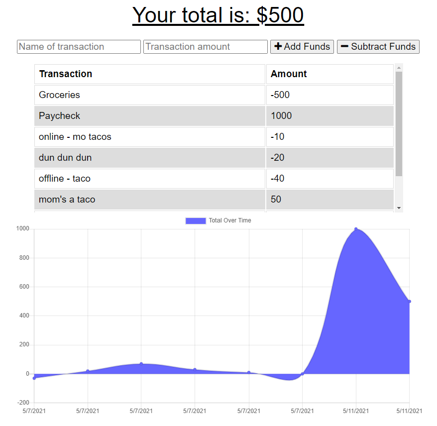

# Budget-Tracker
A budget tracker that has both online and offline functionality.

## Description
Users can add the name and amount of a transaction and select if this transaction adds funds or substracts them. Transactions are listed in an easy to read table and graph. Transactions are recorded in a client-side cache and indexDB. If a user loses internet connection they will still have full functionality using this client-side data. The entire database is copied into the user's IndexDB to ensure functionality at anytime. When internet connection resumes the transactions recorded locally will be pushed to the server-side database.

### Link
[Online/Offline Budget Tracker](https://blooming-basin-50325.herokuapp.com/)

## Screenshot

### Recognition
Starter code provided by Trinity Education Services